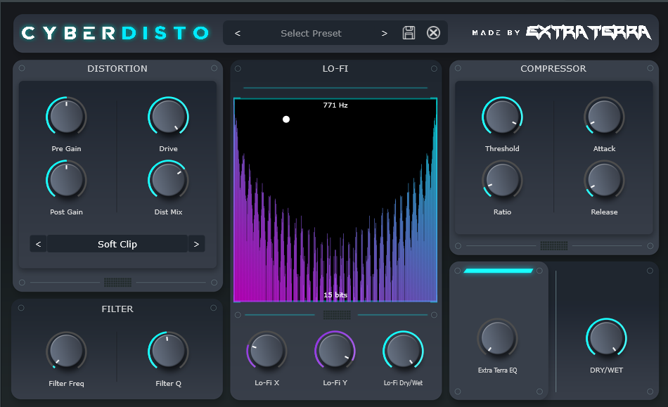

# CyberDisto: Distort Reality, Not Just Audio 🤖🎛️

Welcome to the neon-soaked, circuit-fried world of CyberDisto, where your audio gets a one-way ticket to the digital wasteland! 

## 🌆 What is this chrome-plated noise machine?

CyberDisto is not just an audio plugin; it's a cybernetic implant for your DAW. It takes your pristine audio and runs it through a gauntlet of digital destruction, emerging on the other side as something that would make even a malfunctioning AI scratch its virtual head.

## 🔊 Features that'll make your motherboard blush:

- 🔥 Distortion algorithms so hot, they'll melt your CPU's thermal paste
- 🎛️ A filter section that cuts frequencies like a laser through neon fog
- 💾 Lo-Fi effects that'll take your audio back to the future... of the past
- 🦾 "Extra Terra" EQ: Because why settle for earthly tones?
- 🕹️ An XY pad so addictive, you'll forget you're supposed to be making music
- 🧠 Presets that'll make you question the nature of reality (and your mix)

## 💎 Full Version vs. Beta
- 🌟 Full Version: Available exclusively on [Patreon](https://www.patreon.com/posts/cyberdisto-vst3-114553758). Support the developer and get access to all features!
- 🧪 Beta Version: Available here on GitHub. A taste of the cyber-future, but with limited features.

## 🚀 Installation: Hack the Planet (or just your audio) - Windows 64-bit only, MacOS version will come later!

### System Requirements
- A 64-bit Windows PC that hasn't achieved sentience (yet)
- 64-bit DAW compatible with VST3 plugins
- Windows 10 or later (64-bit version)
- At least 300MB of RAM (8GB recommended for maximum reality distortion)

### Installation Steps
1. **Download**: 
   - Full Version: Grab the latest 64-bit build from our [Patreon page](https://www.patreon.com/posts/cyberdisto-vst3-114553758).
   - Beta Version: Download the latest 64-bit release from the [GitHub Releases page](https://github.com/DrFuturo/CyberDisto-VST3-v0.9-Beta/releases).

2. **Extract**: Unzip the downloaded file to a temporary location. Don't be alarmed if your computer starts speaking in binary.

3. **Install**:
   - Locate the `.vst3` file in the extracted folder.
   - Copy this file to your 64-bit VST3 plugins folder. The standard location is:
     - `C:\Program Files\Common Files\VST3`
   - If your DAW uses a custom VST folder, refer to its documentation for the correct location.

4. **DAW Integration**:
   - Restart your 64-bit DAW if it was open during installation.
   - Most DAWs will scan for new plugins on startup. If not, you may need to manually scan or add the plugin folder in your DAW's preferences.
   - CyberDisto should now appear in your DAW's plugin list under "Effects" or "Distortion".

5. **Start Distorting**: Slap CyberDisto on a track and watch your waveforms cry 64-bit silicon tears.

If you encounter any issues during installation, please reach out to Extra Terra.

Note: 
- CyberDisto is currently available only for 64-bit Windows systems.
- Mac and Linux versions are in development. Stay tuned for updates!

## 🕶️ Usage: Navigating the Digital Wasteland

1. Twist knobs until your ears beg for mercy
2. Abuse the XY pad like it owes you crypto
3. Switch between distortion types faster than a netrunner's neural interface
4. Save presets. Load presets. Question your life choices.
5. Repeat until your mix sounds like it was processed by a sentient vending machine

## 🛠️ Building from Source (For the Brave or Foolish)

1. Clone this repo (at your own risk)
2. Make sure you have JUCE installed (good luck with that)
3. Compile and pray to whatever digital deity you believe in
4. If it builds successfully, congratulations! You're now legally responsible for any interdimensional rifts it may cause

## 🐛 Known Issues (Features?)

- May occasionally summon digital demons
- Not responsible for any temporal paradoxes caused by the Lo-Fi section
- "Extra Terra" EQ might actually contact extraterrestrial life forms
- Using all features simultaneously may create a black hole in your mix

## 🙏 Contributing

Found a bug? Want to add a feature that'll further corrupt the fabric of audio reality? Submit a pull request! But remember, with great power comes great responsibility... and possibly tinnitus.

## 📜 License

CyberDisto is released under the "We're All Living in a Simulation Anyway" license. 

- Full Version: Exclusive to Patreon supporters. Terms available on Patreon page.
- Beta Version: Free for personal use. Redistribution, modification, or commercial use requires explicit permission.

---

Remember, in the world of CyberDisto, there are no bugs, only "alternative sonic realities." Now go forth and distort responsibly! 🎚️🔊🦾

P.S. For the full, unrestricted cyber-audio experience, join us on Patreon. Your support keeps the digital dystopia alive!
